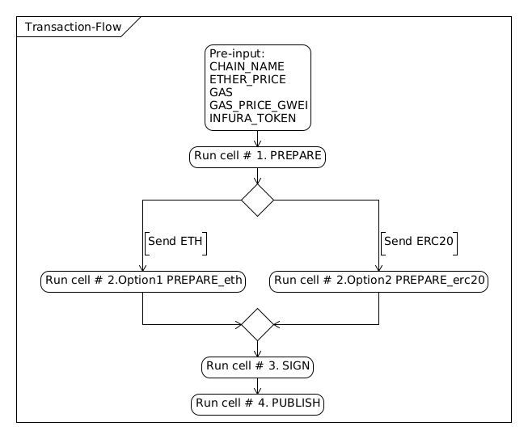

# eth_web3_tx_offline_helper
Create, sign and publish ethereum transactions for ETH or ERC20 tokens. 
Similar to https://www.myetherwallet.com/send-offline-helper without bloatware and pure python3.8+

Optionally step `3. Sign` can be wrapped into single executable via `pyinstaller -F 3step.py`